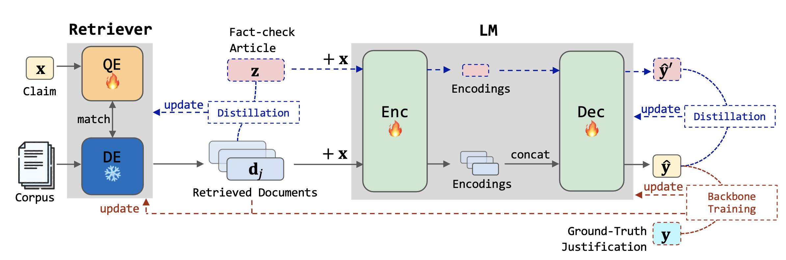

# JustiLM: Few-shot Justification Generation for Explainable Fact-Checking of Real-world Claims 

This is the repository of few-shot justification generation model JustiLM. 

- JustiLM is a justification generation method based on retrieval-augmented language model for explainable fact verification on real-world claims, which leverages fact-check articles as auxiliary information for model training.


<p align="center">

</p>


## Requirements

Our code is developed based on the [Atlas](https://github.com/facebookresearch/atlas) codebase. Plese refer to the Atlas repo for setup instruction.

Our dataset is extended on the [WatClaimCheck](https://github.com/nxii/watclaimcheck) dataset. Plese refer to the WatClaimCheck repo for data acquisition.

## Data Preprocess

After obtaining the WatClaimCheck dataset, please construct the retrieval corpus:
```
1. Gathering all reference documents based on the instance ids in ids.json.
2. Split each reference document into disjoint 100-word text chunks.
3. Merge all text chunks resulting in the retrieval corpus.
4. Please ensure that the corpus file (PASSAGES) is in JSONL format: {"id": doc id, "title": "", "text": text chunk}.
```
To construct the fact-check article file:
```
1. Gathering all fact-check articles (i.e., the "review_article" file) from the dataset based on the instance ids in ids.json.
2. Remove the justification section of each fact-check article.
3. Please ensure that the fact-check article file (FC_FILE) is in JSON format: {instance id: fact-check article}.
```

To construct the label file for veracity classification:
```
1. Gathering all rating values (i.e., 0,1,2) from the dataset based on the instance ids in ids.json.
2. Please ensure that the label file (LABEL_FILE) is in JSON format: {instance id: rating}.
```

## The format of input data

Please ensure that the train and test data files (TRAIN_FILE and EVAL_FILES) are in JSONL format, with the following fields for each line:
 ```
 {"id": instance id, "query": claim, "target":justification}
 ```

## Training & Evaluation

To train JustiLM with default hyperparameters and article-level losses, run the following command:
```
sh train.sh
```
After training, the script will automatically output the test results. You can also customize the hyperparameters and data directory by checking the file options.py.

## Citation

If you use this code in your research, please cite our [paper]().

```
TBD
```

## Contact for issues
- Fengzhu Zeng, fzzeng.2020@phdcs.smu.edu.sg
- Wei Gao, weigao@smu.edu.sg

